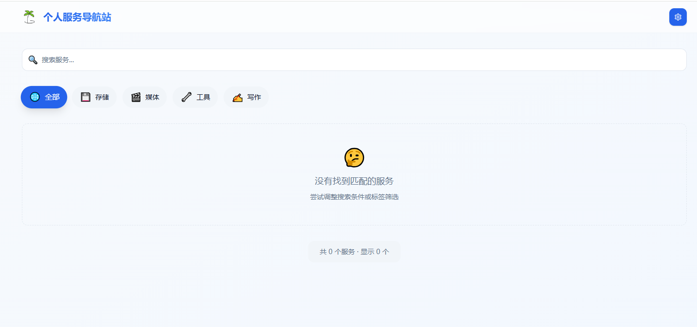

# 个人服务导航站

一个轻量、好看的个人自托管服务导航页，帮你把散落各处的自建服务统一收纳、快速访问。



## ✨ 功能特性

- **服务卡片展示** — 以卡片网格形式展示所有服务，支持图标、名称、描述、链接
- **标签分类过滤** — 内置存储、媒体、工具、写作等分类标签，一键筛选
- **全文搜索** — 实时搜索服务名称、描述及标签
- **管理后台** — 独立的 `/admin` 页面，支持添加 / 编辑 / 删除服务
- **站点设置** — 自定义站点标题、描述、主题
- **明暗主题** — 支持亮色 / 暗色 / 跟随系统三种主题模式
- **数据导入导出** — 一键备份或迁移全部数据
- **Docker 单镜像部署** — 前端 + 后端 + Nginx 打包进一个镜像，极简运维

## 🛠 技术栈

| 层级 | 技术 |
|------|------|
| 前端框架 | React 18 + TypeScript |
| 构建工具 | Vite 5 |
| 样式方案 | Tailwind CSS 3 |
| 路由 | React Router DOM v6 |
| 图标库 | Lucide React |
| 后端 | Node.js + Express |
| 数据存储 | JSON 文件（本地持久化） |
| 容器化 | Docker + Nginx + Supervisord |

## 📁 项目结构

```
HomePage/
├── src/
│   ├── components/          # 通用组件
│   │   ├── ui/              # 基础 UI 组件
│   │   ├── Header.tsx       # 顶部导航栏
│   │   ├── Footer.tsx       # 底部栏
│   │   ├── ServiceCard.tsx  # 服务卡片
│   │   ├── ServiceList.tsx  # 服务列表（管理用）
│   │   ├── ServiceForm.tsx  # 服务表单（新增/编辑）
│   │   └── SettingsPanel.tsx# 设置面板
│   ├── pages/
│   │   ├── Dashboard.tsx    # 首页（服务展示）
│   │   └── Admin.tsx        # 管理后台
│   ├── lib/
│   │   └── api.ts           # 接口请求封装
│   ├── types/
│   │   └── index.ts         # TypeScript 类型定义
│   ├── App.tsx              # 根组件 & 路由配置
│   └── main.tsx             # 入口文件
├── server/
│   ├── index.js             # Express 后端服务
│   ├── package.json         # 后端依赖
│   └── data/                # 数据持久化目录
│       ├── services.json    # 服务数据
│       └── settings.json    # 站点设置
├── docker-compose.single.yml# Docker Compose 配置
├── Dockerfile.single        # 多阶段构建镜像
└── index.html               # HTML 入口
```

## 🚀 快速开始

### 方式一：Docker 部署（推荐）

```bash
# 克隆项目
git clone <your-repo-url>
cd HomePage

# 构建并启动
docker compose -f docker-compose.single.yml up -d

# 访问
open http://localhost:3000
```

> 数据持久化到 `./server/data/` 目录，重启容器不会丢失数据。

### 方式二：本地开发

**1. 启动后端**

```bash
cd server
npm install
npm start
# 后端运行在 http://localhost:3001
```

**2. 启动前端**

```bash
# 项目根目录
npm install
npm run dev
# 前端运行在 http://localhost:5173
```

## 📡 API 接口

后端提供以下 REST 接口（端口 `3001`）：

| 方法 | 路径 | 描述 |
|------|------|------|
| GET | `/api/services` | 获取全部服务 |
| POST | `/api/services` | 新增服务 |
| PUT | `/api/services/:id` | 更新服务 |
| DELETE | `/api/services/:id` | 删除服务 |
| GET | `/api/settings` | 获取站点设置 |
| PUT | `/api/settings` | 更新站点设置 |
| GET | `/api/export` | 导出全部数据 |
| POST | `/api/import` | 导入数据 |
| POST | `/api/clear-all` | 清空所有数据 |
| GET | `/health` | 健康检查 |

## 🗃 数据格式

**服务（Service）**

```json
{
  "id": "string",
  "name": "服务名称",
  "description": "服务描述",
  "url": "https://example.com",
  "icon": "🎬",
  "tags": ["媒体", "工具"],
  "order": 0
}
```

**站点设置（Settings）**

```json
{
  "title": "个人服务导航站",
  "description": "管理和访问您的个人服务",
  "theme": "system"
}
```

> `theme` 可选值：`light` | `dark` | `system`

## 🐳 Docker 镜像说明

采用多阶段构建，最终镜像基于 `nginx:alpine`，包含：

- **Nginx**：托管前端静态文件，反向代理 `/api/` 到后端
- **Node.js**：运行 Express 后端（端口 3001）
- **Supervisord**：同时管理 Nginx 与 Node.js 进程

```
容器内部结构：
  :80   → Nginx → 前端静态文件
  :80/api/ → Nginx 反代 → Node.js:3001
```

对外只暴露 `3000:80` 一个端口，无需单独暴露后端端口。

## 📝 开发命令

```bash
npm run dev      # 启动开发服务器
npm run build    # 构建生产包
npm run preview  # 本地预览构建产物
npm run lint     # ESLint 代码检查
```

## ⚙️ 个性化配置

上传 GitHub 前或部署前，建议根据实际情况修改以下配置：

### 底部信息（版权 & 备案）

编辑 `src/components/Footer.tsx`：

| 项目 | 默认值 | 说明 |
|------|--------|------|
| 站点名称 | `Personal Service Dashboard` | 底部版权声明中的站点名 |
| 技术支持 | `Powered by React + Vite + Tailwind CSS` | 可替换为你的自定义文案或删除整行 |

```tsx
// src/components/Footer.tsx
<p className="text-sm text-muted-foreground">
  © {currentYear} Personal Service Dashboard. All rights reserved.
</p>
```

> ⚠️ 如需添加 ICP 备案号，请自行补回 `<p>备案号：XXXX</p>`，并确保域名已完成工信部备案。

### CORS 跨域配置（Docker 部署）

部署到非 `localhost` 域名时，需要修改 `docker-compose.single.yml` 中的 `CORS_ORIGIN`：

```yaml
environment:
  - NODE_ENV=production
  - CORS_ORIGIN=https://your-domain.com   # ← 修改为你的实际域名
```

本地开发环境默认值为 `http://localhost:3000`，无需修改。

### 其他可调整项

| 文件 | 配置项 | 说明 |
|------|--------|------|
| `vite.config.ts` | `base` | 部署在子路径时改为 `./` |
| `vite.config.ts` | `sourcemap` | 生产环境保持 `false`，避免源码泄露 |
| `server/data/settings.json` | `title` / `description` | 站点标题和描述（可在管理后台 UI 中直接修改） |

---

## 📄 License

MIT
